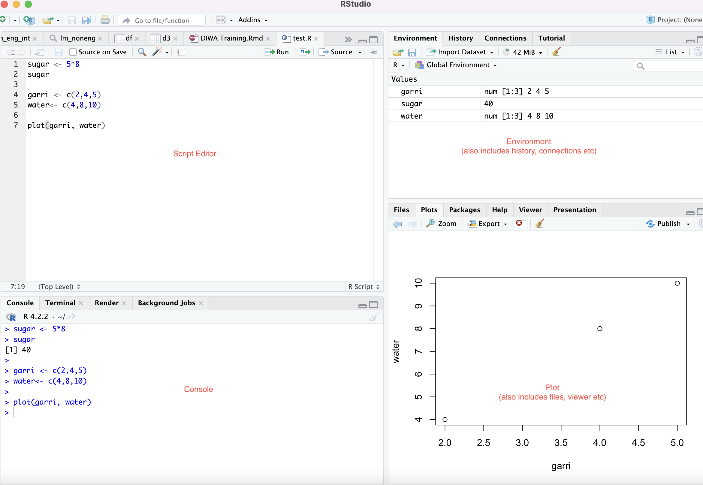

    
---


Congratulations!  If you enjoy solving problems, you will enjoy `R`. 

R simply works as a programming language that let us create objects and use reuse them as we want in subsequent iterations.


RStudio also has a useful help menu. In addition, you can get information on any function or integrated data set in Rthrough the console, for example:


You can learn more from FREE resouces such as [Quick-R](http://www.statmethods.net) or  [the Rcookbook ](http://www.cookbook-r.com)

# Workshop Goals 
In this workshop, we provide a broad overview of the fundamentals of using R, a programming language geared toward statistical analysis and data science. The workshop is divided into four parts, which cover the following topics:

+ Part 1: Introduction to R, navigating RStudio, variable assignment, data types  and data structures.
+ Part 2: Working with data frames using base R: importing, subsetting. 
+ Part 3: Introduction to using modern data management tool in R (Dplyrs)
+ Part 4: Data visualization using R and ggplot2.

No prior experience with R is required.


# Setting up R and R-Studio

## Installation Instructions 
RStudio is a software commonly used by R practitioners to develop code in R. We will use RStudio to go through the workshop materials, which requires the installation of **both the R language and the RStudio software**. If you would like to run R on your own computer, complete the following steps prior to the workshop:

## Download R
[Download R](https://cloud.r-project.org/): Follow the links according to the operating system you are running. You will first need to click on a link corresponding to your operating system, and then an additional link to select a specific version of R. Download the package, and install R onto your computer. You should install the most recent version (at least version 4.1).

If you are using a Mac, click "Download R for macOS" and then select the right version of R. You will need to select the version corresponding to your specific version of macOS, as well as whether you have an Intel or Apple Silicon Mac.

If you are using Windows, click "Download R for Windows", then click "base", and click the download link.


## Download R Studio
[Download RStudio](https://posit.co/download/rstudio-desktop/#download): Install RStudio Desktop. This should be free. Do this after you have already installed R. 
Some individuals with older operating systems may run into odd issues. If you are running into issues with the installation of RStudio, you may need to install a specific version of RStudio. Please check this link if this applies to you.

## Use R on the Cloud
[Try PositCloud](https://posit.cloud/): If you don't have the resources to download R and RStudio on your system, you can still work directly on R by using their cloud platform. Simply start a new project and you'll be taken to the interface. However, I strongly advise downloading R and RStudio on your system if you don't have constant access to the internet and want to work with local files. Additionally, the free version of the cloud platform is restricted.

# Getting Ready


## Step 1: Understand RStudio Interface

When you open RStudio for the first time, there should be four panels visible, as depicted in the Figure below.

+ Script Editor (upper left panel)
+  Environment (upper right panel): includes Environment and History tabs
+ Console (lower right panel)
+  Plot (lower right panel): includes Files, Viewers etc

The R interface consists of four panels:


```{r echo=FALSE, out.width = "90%", fig.align = "center"}
setwd("/Users/User3/Downloads/diwacegapretrainingdatawranglingandmodellinginr (1)")

library(knitr)

```

1. *Script Editor (upper left panel):* This is where you can write and edit your R code. This is also where find the `run` tab or button needed to execute your codes.

2. *Environment (upper right panel):* This panel has four tabs that includes two main tabs, Environment and History. The Environment tab shows information about the objects and data that you have loaded into R, while the History tab displays a log of the commands that you have executed.

3. *Console (lower left panel):* This is where the output of your R code is displayed, and where you can enter commands directly.

4. *Plot (lower right panel):* This panel includes multiple tabs, such as Files and Viewers, and is used to display graphics and plots generated by your R code.


## Step 2: Get to know your working directory

**Work on the same folder (working directory) **: In R, we need to operate within a specific folder on our system, known as the working directory. This is where all our R code and files are stored and accessed. 

To determine your current working directory, you can use the `getwd()` function. If it's not already present in your script editor, simply copy the code `getwd()` and run it in your script editor. It will display the path on your console that R is presently utilizing. It's recommended that you keep all the files you'll be using in R within this working directory. You may also change the working directory if necessary, but we'll cover that later. For now, let's focus on locating it.

```{r , message=F}
getwd()

```


## Step 3: Understand Operators in R

+ Assignment Operators
+ Arithmetic Operators
+ Logical Operators

### Assignment Operators


**Assigning values to objects**

R stores information as an *object*. You can name objects whatever you like. Just remember to not use names that are reserved for build-in functions or functions in the packages you use, such as sum, mean, or abs . Most of the time, R will let you use these as names, but it leads to confusion in your code.

Operators are used to assign values to variables, and there are two types of assignments: leftward and rightward.  The rightward assignment operator is also commonly known as the equals `(=)` operator. For now, we will focus on the leftward assignment operator, which is represented by <-.  It is called "leftward" because the value on the left-hand side of the operator is assigned to the variable on the right-hand side of the operator. The operation <- is often preferred because  = is used for other functions.


Operators `<-` and  `=` are used to assign values to any variable.

||Operator|Type|
| :- | - | - |
|Assignment|<- or = ||

### Few things to remember

+ Do not use special characters such as $ or %. Common symbols that are used in variable names .
+ Remember that R is case sensitive.
+ The # symbol is used for commenting and demarcation. Any code following # will not be executed.


### Arithmetic Operators

Just like any regular calculator, you have to pay attention to the order of operations!


||Operator|Example|
| :- | - | - |
|Addition|+|2+4|
|Subtraction|-|2-4|
|Multiplication|\*|2\*4|
|Division|/|4/2|
|Exponentiation|ˆ|2ˆ4|
|Square Root|sqrt()|sqrt(144)|
|Absolute Value|abs()|abs(-4)|


### Logical operators


|Operator|
| :- | - | 
Less than|<|
Less than or equal to|<=|
Greater than| >|
Greater than or equal to|>= |
Exactly equal to|== (note that `=` is double) |
Not equal to|!=|
Not x|!x|
x or y |x y|
x and y|x & y!|


Logical operators are incredibly helpful for any type of exploratory analysis, data cleaning and/or visualization task.


## Step 4 (optional): Change your current working folder

I mentioned that we can change your current working directory (wd) earlier. You can use the function `setwd`() to do that. You only need to copy the path of the folder from you folder and paste it inside the bracket. 

Please **note** that in R, the separator in the path names is the front slash `/` and not the back slash `\` that you find in most operation system . This means that if you are copying paths directly from your operating system for this task or future tasks,  you change the path separators to front slash `/`. The  "forward slash" / is also more commonly used by Unix, Linux, and macOS.
 
```{r , message=F}
#setwd("/Users/User3/Downloads")

```


We can also set path directly from the  "menu bar" or "toolbar . The easiest way to do this is to a set default working directory: Session > Set Working Directory.

# Getting Started 

## Data Structures in R and Executing your first codes 

**FIND THE RUN BUTTON**: For every code you type, you need to Run it. Please find the R button, or the  button that looks like  `play`  if you are using R markdown

To execute a single line of code in RStudio, you can either click the "Run" button at the top of the editor pane, or use the keyboard shortcut: press Command + Return (on macOS) or Ctrl + Enter (on Windows).

If you are working with Rmarkdown, where codes are broken down into different chunks, you can run each chunk of code by clicking the "play" button next to it. Alternatively, you can use the "Run" dropdown and select "Run Selected Line" to run a specific line of code.

To execute multiple lines of code at once, highlight the respective portion of the code and then run it using one of the methods mentioned above.


Now, let's start learning how to use R by exploring seven important data structures in R:

+  expression
+  object
+  vector
+  list
+  data frame
+  matrices
+  arrays

1. **EXPRESSION**: In R, when you perform an arithmetic or logical operation, it is typically called a "statement" or an "expression". It is a special data type because in this case, you are not creating or modifying anything. It allows you to build simple or complex operations and scripts that can be executed in a single step.
```{r , message=F}
1+2 # addition
8/3 # division
7<4 # less than
4>=2 #greater than or equal to

4 == 4 # the same value as. Please note that `=` is double
4!=4 # not the same value as
4!=5 # not the same value as

sqrt(144) # square root
3^2  #exponential
144^(1/2) # using exponential method for square root of 144
27^(1/3) # cube root of 27


```


2. **OBJECT**: Since we can not do much with an expression, an object in R is a data structure that holds data and information. In order to create a new object or modify an existing one in R, we use the assignment operator which is represented by the symbol `<-` (not `<`)
```{r , message=F}
sugar <- 1+2 # E.g 1 gram of brown sugar & 2 grams of white sugar
garri <- 8-2  # E.g removing 2 grams of garri out of 8 grams left in a bowl


sugar #to view  the object created, rewrite the object name
garri
```


3. **VECTOR**: A vector is simply a list of items that are of the same data type. They are six types of atomic vectors- logical, integer, character, raw, double, and complex. A vector in R is a collection of elements of the same data type, such as numbers, characters, or logical values. 

A vector can be created by using the c() function, which concatenates its arguments into a vector. For example, we can create the object `sugar` and `garri` into a vector. We can also do that for a new set of numbers. Since its not an object, it will display itself, once you run it.

```{r , message=F}
c("sugar", "garri")
c (3,6)
```


4. **LIST**: A *list* in R is a data structure that can contain *many different data types* inside it. It is ordered and changeable.  *vector* discussed above is is a collection of elements of the *same data type* (e.g., numeric, character, logical) arranged in a one-dimensional array. 

A list, on the other hand, is a collection of objects of different types (e.g., vectors, matrices, data frames, other lists) arranged in a nested structure. In this example, you can see that we combined numeric and character data type in the same code and created an object called `mylist`. It is created with the built-in function `list`.
```{r , message=F}
my_list <- list(c(3, 6, 11), c("sugar", "garri"))
my_list
```


5. **DATA FRAMES**: 
The data frame is one of the most commonly used data structures in R, particularly for giving data a structured format. Data frames are represented as tables, with rows and columns that define the dimensions of the data. When learning R programming, data frames are often denoted as df, although the actual name of the dataset will vary - depending of the name you choose to call it . It is important to specify that you are creating a data frame when working with data in R, otherwise R may interpret it as a vector or list, which may not be useful for data manipulation.

When importing external data, such as CSV or Excel files, you only need to create an object for it. In this case, the structure of the data is already defined in the file, so you do not need to specify it again. We will discuss how to import data into R (such as Excel or CSV) in the later sections. For now, we will work mainly on data (specifically dataframes) created within R.

To create a data frame in R, you can use the data.frame() function, which combines vectors or other data types of the same length into a single object. Here is a simple example of how to create a data frame in R:

```{r , message=F}
ingredient <- c("Sugar", "Garri", "Water") # a vector of character type
qty <- c(3, 6, 11) # a vector of numeric type

# Combine vectors into a data frame
my_df <- data.frame(Ingred = ingredient , Qty = qty) #combine them in to a df

# View the data frame
my_df


```


6. **MATRICES**: We will not be needing to construct matrix and arrays for this lesson but it is important to know the slight differences between them and a data frame. 

**Difference between Matrices and Dataframe**
A matrix is a two dimensional data set with columns and rows. In a matrix, all columns and rows must have the same length, while in a data frame, columns can have different lengths.This means that in a data frame, each observation or data point does not have to have the same number of variables or features. 

Overall, while matrices and data frames are both two-dimensional data structures in R, they have different rules and properties that make them useful for different purposes.

Matrices are best used for mathematical operations and computations, while data frames are best used for organizing and working with real-world data sets that may have different variable lengths and data types.


Here is a simple example of a matrix using the `as.matrix` function :

```{r , message=F}
# Create a nested list of values
my_list <- list(c(1, 3, 5), c(2, 4, 6))

# Convert the list to a matrix
my_matrix <- as.matrix(my_list)

# Print the matrix
my_matrix
```


8. **ARRAY**
While a matrix is two-dimensiional, an array has more than two dimension. To understand what that means, here we create a 3x4x3 array, where the first dimension represents the month, the second dimension represents the type of product (e.g., food, clothing, electronics), and the third dimension represents the store location (e.g., downtown, uptown, suburbs). Using the `array` function, you will see that r created another *layer* for each store location. That means it took the two dimensions of months and products, and then created another dimension for each which is the store location. This is how arrays look like. However, we will not need it for this lesson as said. It is mainly used for computational work.

```{r , message=F}
sales_data <- array(c(500, 300, 100, 200, 600, 400, 150, 250, 700, 500, 200, 300, 400, 200, 80, 150, 500, 250, 100, 200, 600, 300, 120, 250, 300, 100, 50, 80, 400, 150, 60, 100, 500, 200, 80, 120), dim = c(3, 4, 3), dimnames = list(c("Jan", "Feb", "Mar"), c("food", "clothing", "electronics", "other"), c("downtown", "uptown", "suburbs")))
sales_data
```


## Basic Terms in R

+ **Functions**: is a block of organized and reusable code that performs a specific tasks which are often inbuilt. Additionally, users can also create new in a customized function  There are many in-built functions in R but a simple example is  the mean which is referred to as`mean()`. The mean of a vector of nuber called `x` will be `mean(x)`.


+ **Parameters**:   are passed into a function as inputs to modify the result. For example,to tell R to ignore missing values while computing the means, you can use the paramater `na.rm=TRUE` that inside the `mean()` function. This will be written as  `mean(x, na.rm= TRUE)`. The `na.rm=TRUE` is the parameter.

+ **Help and Documentation**:  if you need help on knowing the parameters in a function or more information about any function, you can use the help function which is  denoted as `help()` or `?()`.  For the mean function, for example, the code for help or its documentation will be `help(mean)` or `?mean`.


+ **Packages & library**: Base R, the default installation of R, does not include certain tools. However, other authors have created these tools, which can be imported into R by following two procedures. First, you must install them, which is a one-time process, and these tools are known as packages. Once installed, you must inform R that you want to use a specific package by calling the `library` function whenever you need to use the tools included in that package.


## Basic Functions in R


+ str(): returns the data types of each column in a dataframe.

+ head(): often used do display the first nth rows (observation) of a dataframe, rather all the rows, especially for larger datasets. The default n is 6, but you can specify the n.

+ tail(): just like the head, often used do display the last few rows (observations) of a dataframe, rather all the rows, especially for larger datasets. The default n is 6, but you can specify the n.

+ nrow(): returns the number of rows (observations) in the dataset.

+ ncol(): returns the number of columns (variables) in the datasets.

+ colnames() : returns the column names.

+ rownames(): returns the row names.

+ dim(): returns the number row and columns together (referred to as dimension).
It returns a  vector of length two with the number of rows in the first element and the number of columns in the second element.

+ unique() : returns unique observations only.


+ class(): It returns a character vector that describes the class or classes of the object.


### Examples of Basic Functions in R


```{r , message=F}

str(my_df)
# Show the first "n" rows (default is 6)
head(my_df, n = 2)
# Show the last "n" rows (default is 6)
tail(my_df, n = 2)
# Dimensions of dataframe
dim(my_df)
# Number of rows
nrow(my_df)
# Number of cols
ncol(my_df)
# Show column names (two different ways)
colnames(my_df)
names(my_df) 
# Show row names (unnamed: default to character type for row number)
rownames(my_df)
# Show rows with unique data
unique(my_df)

# install a package:

# call an installed package 
library (dplyr)

```


# Data Manipulation in Base R
"Base R" is the term used to describe the fundamental set of functions and data structures that come pre-installed with the R programming language. These functions and structures serve as the building blocks for all R code. To demonstrate the use of Base R, let's create our first dataset and manipulate the data with these core functions.

## My first dataset in R
As the research manager of a multinational organization, you have received complaints of weight discrimination against overweight women (assumed here to mean those weighing 100kg and above) during the hiring process, even though a policy prohibiting such discrimination has been in place since 2015. To investigate this issue further, you have randomly selected a sample of 20 staff members and recorded their weights. Your sample is evenly split between men and women, with 10 individuals of each gender. 

The men's weights (in kg) are (89, 75, 88, 75, 49, 89, 110, 120, 89, and 75), while the women's weights (in kg) are (75, 76, 87, 110, 67, 76, 43, 55, 59, and 60). You also collected additional information about the sample staff. Here we want to create a dataset of 6 variables consisting data about 20 staff in the organization. The variables are `Gender`, `Weight`, `income`, `rating`, `marital status` and whether staff stays in the `city central`.

+ **Gender**: is to know whether they considered to be  male or female 
+ **Weight** is their human body weight measured in kiloggram
+ **Income**: Their monthly income in dollars
+ **rating**: Their rating of the recruitment process
+ **Marstatus**: is whether they are single, married or divorced
+ **CityCentral**: is whether they stay close to the city central or not

```{r , message=F}

# Create Gender variable and ensure to enclose characters in quotes.

Gender <- c("Male", "Male", "Male", "Male", "Male", 
            "Male", "Male", "Male", "Male", "Male", 
            "FeMale","FeMale", "FeMale","FeMale", "FeMale",
           "FeMale","FeMale","FeMale","FeMale","FeMale")

#another method for creating the same Gender variable  is using the `rep` function
# Gender <- c(rep("Male", 10), rep("Female", 10))

# create weight
weight <- c(89, 75, 88, 75, 49, 89, 110, 120, 89, 75, 
            75, 76, 87, 110, 67, 76, 43, 55, 59, 60) 

# create income
income <- c(50000, 95000, 120000, 800000, 650000, 92000, 94000, 222000, 543000,75000,
            63000, 40000, 99000, 450000, 180000, 190000, 96000, 780000, 150000, 342000)

# create weight
rating <- c(5, 1, 2, 4, 9, 9, 8, 1, 9, 7, 
            5, 6, 6, 1, 1, 1, 3, 6, 9, 4) 

Marstatus <- c("Married", "Married","Single", "Single","Single",
             "Single", "Divorced","Single", "Married","Single",
             "Married", "Single","Single", "Divorced","Single",
             "Single", "Divorced", "Single","Married", "Divorced")

CityCentral <- c("Yes","No","Yes","Yes","Yes","Yes","Yes","Yes","No","Yes",
                 "No","No","Yes","Yes","No","Yes","No","Yes","No","No")


#Create a dataframe, method 1: A simplier method using the `data.frame` function 
officew <- data.frame(Gender, weight, income, rating, Marstatus, 
                               CityCentral)

# Create a dataframe. method 2:  In the method below you have to use  cbind and `as.data.frame` function . Not the most efficient method.

#officew <- as.data.frame(cbind(Gender, weight, income, rating, Marstatus, 
                           #    CityCentral))

officew 
```

You will notice that when were creating new vectors we used the `c()` function which is used to concatenate or combine different elements into a single object.

It will good to note that R assumes that each observation in a variable corresponds to the same individual across all other variables. For example, the first observation in the `Gender` variable is assumed to be the same person as the first observation in the `Income` variable, who earns 50,000, has a rating of 5, and is married. Therefore, it is essential to maintain the order of observations across variables.

Additionally, we can also use the cbind() function to combine multiple objects as columns into a single data frame object in R. We will explain this in more detail later on. However, I paused that method since its inefficient.


## Let's do some BASIC STATS

## The Mean, SD, Mode, Median


```{r , message=F}

mean(officew$income, na.rm=T)
sd(officew$income, na.rm=T)
mean(officew$weight, na.rm=T)
sd(officew$weight, na.rm=T)
mode(officew$rating)
median(officew$rating)
```


### Converting a character into a factor


First, you want to check the class (data type) of the variable
```{r , message=F}

class(officew$Marstatus)

```


As you may remember, it was created as a character variable and most times, we want marital status to be a categorical variable. You will use `as.factor()` function,  `factor()` or `as.factor(as.character())` referred in nested approch to perform this operation. For simplicity, I advise you use `as.factor()`
```{r , message=F}

officew$Marstatus<- as.factor(officew$Marstatus)
#officew$Marstatus<- as.factor(as.character(officew$Marstatus))

class(officew$income)
```


To create a Marital status variable in R, the most efficient way is to use the `factor()` function and specify the levels using the levels argument. This eliminates the need to convert the variable from character to numeric later on.

This creates a factor variable with the specified levels and assigns it to the object `Marstatus`. This approach can save time and reduce errors in your code.
```{r , message=F}
# Define the levels of the factor
marital_levels <- c("Single", "Married", "Divorced")

# Create the factor variable with specified levels
Marstatus <- factor(c("Married", "Married", "Single", "Single", "Single", "Single", "Divorced", "Single", "Married", "Single", "Married", "Single", "Single", "Divorced", "Single", "Single", "Divorced", "Single", "Married", "Divorced"), levels = marital_levels)

# View the levels and values of the factor
levels(Marstatus)


```


## Importing files
### Direct Importing
R allows you to import data from a variety of file formats, including `csv`, `xls`, `dta` (Stata), and `sav` (SPSS) files. To import data, you first need to load the required libraries and then use the appropriate function for the file format.

For example, if you have a `dta` file and want to import it into R, you can use the `readr()` library and the `read_dta` function inside the library. Alternatively, if you have a `csv` file, you can use the read_csv function from the same library.


```{r , message=F}
library(readr)
officew_1 <- read_csv("officew.csv")
```
This code loads the `readr` library, reads the `dta` file located at `/officew.csv`, and assigns the resulting data to the `officew_1` object. The file must have been located  in your working directory.


### Specifying parameters when importing
```{r , message=F}
library(readr)
officew_2 <-read.table("officew.csv",
         header=FALSE, # change to "TRUE" to retain the header (column names)
          sep=","         # use "\t" for tab-delimited files
)
```

By default, when importing data into R, character variables are converted to factors. However, this may not always be desirable, and you may want to treat some of these variables as character strings instead. To do this, you can use the `stringsAsFactors` argument when importing data and set it to `FALSE`.

For example, if you have a csv file with character variables and want to import it into R without converting them to factors, you can use the read_csv() function from the readr library and set `stringsAsFactors = FALSE` as shown below:
```{r , message=F}
officew_4 <- read.csv("officew.csv", stringsAsFactors=FALSE)
officew_5 <- read.csv("officew.csv", stringsAsFactors=TRUE)
str(officew_4)
str(officew_5)
```
Conversely, if you want all character variables to be converted to factors, you can set `stringsAsFactors = TRUE`. However, note that this may not be appropriate for all datasets, and you should carefully consider the implications before making this choice.

### Importing files from Github

If you have data stored in the cloud such as github, you can use read `getURL` function in the `RCurl` library to import it from the cloud into R, and then read it with your preferred format such as `dta`. Please note that importing from using `Rcurl` usually requires two steps. The first is getting it from the cloud and the importing it into R in a format that can be used.


```{r , message=F}
#install.packages("readr")
#library(readxl)

library(openxlsx)# export to excel
library(RCurl)
x <- getURL("https://raw.githubusercontent.com/abiola1864/FLS301/main/officew.csv")
officew<- read.csv(text = x)
head(officew)
```

You can also just import it directly using `read.csv` if its a .csv file.
```{r , message=F}
x1 <- read.csv("https://raw.githubusercontent.com/abiola1864/FLS301/main/officew.csv")
```

## Exporting files from R

To export data from R, you can use the `write.csv()` or `write_sav()` functions to save your data as a csv or SPSS file, respectively. Other export options are also available depending on the format you need.

For example, to export your data as a csv file, you can use the `write.csv()` function and specify the name of the file and the data object you want to export. Similarly, to export your data as an SPSS file, you can use the haven package and the `write_sav()` function:
```{r , message=F}
library(openxlsx)# export to excel
library(haven)

write.csv(officew, "officew.csv") #export to csv
write_sav(officew, "officew.sav")#export to spss
```


# Subsetting 


There are multiple approaches to extract a subset of data from a larger data frame in R. One popular method is to utilize the `select` or `filter` function from the dplyr package, which we will cover later. These functions enable the extraction of specific columns of data, such as selecting only the female Gender respondents.

Another method is to use the index position or the `subset` function to extract rows that meet certain criteria, such as only including data for females. In this section, we will focus on the second method. This can be accomplished in two ways, either by referring to the variable name or the index position in R.

Index subsetting in R is performed using the bracket notation with indices for rows or columns. For instance, df[row_index, column_index] returns the specified rows and columns. 

If you want the first row, use df[1, ], while df[, 1] or df[1] returns the first column.  Note that the comma's position changes based on whether you want to return rows or columns. To focus on rows, place a comma after the index and leave the column index blank, e.g., df[1, ] returns the first row, whereas df[, 1 ] or df[1] with no comma returns the first column. Likewise, df[c(1, 2), ] returns the first and second rows, and df[, c(1, 2)] returns the first and second columns.


## Subsetting in Base R by Variable Name

```{r , message=F}
# subset female gender
officew_women1 <- officew[officew$Gender == "FeMale",]

# subset female gender , another method
officew_women2 <- subset(officew, Gender == "FeMale")

# subset female gender and weight
officew_women3 <- subset(officew, Gender == "FeMale", select = 
                           c("weight"))


head(officew_women2[, 1:5])
head(officew_women3)

# male
officew_men1 <- officew[officew$Gender == "Male",]
officew_men2 <- subset(officew, Gender == "Male")
officew_men3 <- subset(officew, Gender == "Male", select = 
                          c("weight"))

head(officew_men2[, 1:5])
head(officew_men3)

```
This code separates data in the `officew` dataframe by gender, creating new dataframes for women and men.

The first line creates a new dataframe called "officew_women1" by subsetting the `officew` data frame to only include rows where the `Gender` column equals `FeMale`.

The second line achieves the same result as the first but uses the `subset()` function instead of subsetting directly.

The third line creates a new dataframe called `officew_women3` that only includes the "weight" column for the subset of data where "Gender" equals `FeMale`.

The next three lines do the same as the previous three but create data frames for men instead of women.


## Subsetting in R by Index Number
Instead of using the variable name to subset a data frame, we can use their index number. For example, we can select only the 3rd and 5th variables (Income and marital status) by referencing their index positions. To find the index number of variables in a data frame, we can use the `colnames()` function, which displays each variable and its corresponding index position.

Please note

```{r , message=F}

colnames(officew)

officew_3_5 <- officew[c(3,5)]
head(officew_3_5)


```


The code below returns the specified rows which are rows 3 qnd 5 (not columns 3 and 5 as above)

```{r , message=F}

officew_3_5_row <- officew[c(3,5),]
head(officew_3_5_row[, 1:5])

```

Note that in most cases, subsetting only requires column selection. Therefore, the introductory lesson on subsetting without commas, which pertains to columns, is adequate. 


Suppose we want to exclude variables in the 3rd and 5th positions (Income and Marital Status). In that case, we can use a `-` sign before each index position to achieve this, like so: `[-3, -5]`. This operation results in columns 1, 2, and 4.

```{r , message=F}
officew_1_2_4 <- officew[c(-3,-5)]

head(officew_1_2_4[, 1:5])

```

Here is another way of writing what we wrote above (including but not excluding)
```{r , message=F}
office_1_2_4B <- officew[c(1,2,4) ]
head(office_1_2_4B)

```
To include the 1st and 2nd variables (columns), and the 4th and 5th observations (rows), while omitting the 3rd observation, we can use the following code in R:


```{r , message=F}
officew_weight_inc_ <- officew[c(1:2),c(4:5)]
head(officew_weight_inc_)
```
Please note that the `:` operator is used to create a sequence of numbers in the same order, so 1:2 refers to the first two rows, and c(4, 5) refers to the fourth and fifth columns.


## Conditional Subsetting

In R, the `|` operator is used to denote "OR".  It returns TRUE if at least one of the statements is TRUE. 

The `&` operator is used to denote "AND". It returns TRUE only if two or more statements that are joined with the operator are TRUE.

To subset a dataframe of female staff whose income is N100,000 and above OR any staff member earns N100,000 and above (i.e., if either condition is met), we can use the following code in R:

```{r , message=F}
office_f_hincome <- subset(officew, income >=100000 | Gender %in% "FeMale",
                  select=c(1:5))
head(office_f_hincome)

```

Also, we can also subset the staff data frame to include only female staff using the Gender variable. We then apply the AND (&) operator to combine two conditions: that the Gender variable equals "Female", AND that the Income variable is greater than or equal to 100,000. 

If we want to subset a dataframe of `female` staff whose  `income is  N100,000 and above`. The two conditions have to be met here.

```{r , message=F}
office_f_hincome1<- subset(officew, income >=100000 & Gender %in% "FeMale",
                  select=c(1:5))

head(office_f_hincome1)
```
Please note that we can also use the `%in%` rather than the `==` operator. In most cases, it is more efficient.  `%in%` is an operator in R known as the "membership" or "inclusion" operator.


#  Working with Categorical Variables (Creating Dummies, Tabulations, Cross Tabulations, Proportions)

## Creating new columns (variables) in Base R
 
In R, you can use the `$` operator to add new columns (variables) to a dataframe. It can be used  to simply assign a vector of values to a new column name using the `$`  operator, as in `df$new_column <- c(1, 2, 3)`. 


## Conditional Statement for Creating Dummy Variables
Conditional statements can be used in R to create new variables by modifying existing ones based on specific conditions. For example, you can use the ifelse() function to create a new column in a data frame based on a condition when elements in the old column is greater than 10, as shown as :

`df$new_column <- ifelse(df$old_column > 10, df$old_column, 0)`

Suppose we have a data frame containing information about staff members, and we want to create a new variable called YEAR that indicates the year each staff member joined the company. We also know that a policy to stop discrimination against overweight women was introduced in 2015, and we want to flag staff members who joined before and after this date.


First, let us create a variable to include all the years that each staff joined.

```{r , message=F}
#First, create the needed variables
  
  #Indicating the year arrived in order of  staff records in other variables
   officew$year <- c(2021, 2004, 2020, 2014, 2015, 2019, 2014, 2015, 2000, 2018, 2008, 2018, 2020, 2019, 2022, 2000, 2005, 2013, 2000, 2021)
 officew$year
  
```

Then  we create a new column called `Post_policy` in the data frame df based on the condition that if the `year` variable is greater than the year `2015`, the new value should be 1, and if it is lesser than or equal to the year `2015`, the new value should be 0 as shown below.


```{r , message=F}

  
  officew$Post_policy <- ifelse(officew$year > 2015, 1, 0)
  officew$Post_policy
  
```


Another example of variable transformation using `ifelse()` is converting gender into a dummy variable called `Gender1`, with `male` represented as 1 and `female` as 0. In this case, `male` is the reference variable.

```{r , message=F}

  
  officew$Gender1 <- ifelse(officew$Gender> "male", 1, 0)
  officew$Gender1
  
```


Another example is creating an overweight variable based on a defined threshold, such as 100 kg and above, assuming all staff members have the same height.

```{r , message=F}
officew$highincome<- ifelse(officew$income>120000, 1, 0)
officew$highincome

officew$overweight<- ifelse(officew$weight >=100, 1, 0)
officew$overweight
```

### Other Examples

Suppose you want to group individuals into only two categories based on their marital status: `Single` and `Other Marital Status`. To do this, you can use a conditional statement called the ifelse function in R. This function can be used in various ways to create new variables based on the values of existing variables.

This code creates a new binary variable called `Marstatus_binary` in the dataset "officew", based on the existing variable `Marstatus` which represents the marital status. If the value of `Marstatus` is "Single", the value of "Marstatus_binary" will be 1. Otherwise, the value of "Marstatus_binary" will be 0.

In other words, the code is creating a new variable that indicates whether each person in the dataset is single (represented by 1) or not (represented by 0).


```{r , message=F}

officew$Marstatus_binary <- ifelse(officew$Marstatus == "Single", 1, 0)

head(officew[, 1:5])


```


## Cross tabulation (conditional tabulation)

Conditional tabulation in R refers to the process of creating tables that show the frequency or proportion of observations in one or more variables based on the levels of one or more other variables. In other words, it involves summarizing data in a table format based on certain conditions. R has several built-in functions for creating conditional tables, including `table()`, `xtabs()`,  `ftable()` and `aggregate()`.  In the following discussion, we will examine each function in detail, and starting with table() and xtabs() functions.


**table(),  xtabs() and aggregrate()**
Both `table()` and `xtabs()` functions are used to create contingency tables in R, but they have some differences in their syntax and functionality.

The `table()` function in R is a  tool for creating contingency tables from categorical variables. These tables display the frequencies of the combinations of levels in two or more categorical variables. 

For example, you can use `table()` to create a contingency table that shows the frequencies of both men and women who are divorced, married, or single. From this table, you can easily see the distribution of gender by marital status in the sample. In the result displayed below, you may already observe that the proportion of genders by marital status in the sample may not be proportionally different between married and single staff.

Unlike the `table()` function in R, the `xtabs()` function provides greater flexibility in constructing contingency tables, while sharing some similarities. Its output includes more information, such as variable names, and can be used to generate contingency tables that incorporate numerical or interval variables. Additionally, the `xtabs()` function allows for further data summarization using the `aggregate()` function.
```{r , message=F}

#table()
mytable<-table(officew$Gender, officew$Marstatus)
mytable

#xtabs()
mytable1<- xtabs(~ Gender + Marstatus, data = officew)
mytable1


#xtabs() with interval variable, displays sum
mytable2<- xtabs(weight~ Gender + Marstatus, data = officew)
mytable2

#xtabs() and aggregrate() with interval variable, displays mean
mytable3<- xtabs(weight~Gender + Marstatus, aggregate(weight~Gender + Marstatus,data= officew, mean))
mytable3
```
Upon using the `xtabs()` function, you will notice that the output includes the names of the dimensions in the object, and it generates the sum for weight when grouped by gender and marital status. For instance, `213kg` represents the total weight of divorced women. 

Another example makes use of the `xtab` and `aggregate()` functions to display the `mean` weight by gender and maritical status. Based on the output, it is evident that divorced men have the highest average weight which is `110kg`, while married women have the lowest average weight which is `67kg`.

```{r , message=F}

#table()
mytable<-table(officew$Gender, officew$Marstatus)
mytable

#xtabs()
mytable1<- xtabs(~ Gender + Marstatus, data = officew)
mytable1

```
**ftable()**


The main use of a `ftable()` function, compared to `xtabs()`, is for creating flat contingency tables from multiple categorical variables. It can display the results of cross-tabulating two or more categorical variables in a matrix format, and also allows for hierarchical grouping of the categories.


```{r , message=F}


mytable<- xtabs(~ Gender + Marstatus+ rating, data = officew)
mytable
ftable(officew[,c("Gender", "Marstatus", "rating")])

```

Based on the display above, it can be observed that when comparing the output of `xtab()` and `ftable()` for multiple categorical variables, `ftable()` is the better option. While I have paused the display of the `xtab()` output, you can still unpause it to see that the results are not presented in a clear matrix format.


## Proportions and Margins
```{r , message=F}
table(officew$Gender, officew$Marstatus)
```


To get the percentages, we use prop.table function
```{r , message=F}
prop.table(xtabs( ~officew$Gender+officew$Marstatus), 2)
```

50 percent of female are single, and 60 percent of males are single. We can say the effect of being a male is 10 percentage point higher for men than women.

```{r , message=F}
prop.table(table(officew$Gender, officew$Marstatus), 1)
```
Let us assume we want to CONTROL for location. We think we can also use the location to staff (either they stay in the central city across both genders to know wnether they are single or not. You just  need to insert the new variable to the TABLE function

```{r , message=F}
# use table()
prop.table (table(officew$Gender, officew$Marstatus, officew$CityCentral), 3)


# use ftable rather than table
mytable5<-ftable(officew[,c("Gender", "Marstatus", "CityCentral")])
prop.table(mytable5, 2)
```

## Full Cross Table:  CrossTable() 
```{r , message=F}
#install.packages("gmodels") First install gmodels package
library(gmodels)
CrossTable(officew$Gender, officew$Marstatus)
```


# Working with Missing Values

## Creating new data using Rowbind and Columnbind in R

To demonstrate how missing values are handled in R, we will generate a new dataset called `df` that includes three variables for each gender. As we learn about missing values, we will also cover how to use `rbind` and `cbind` functions to row-bind and column-bind datasets, respectively.

The `rbind` function can merge the rows of two distinct datasets into a single one. Nevertheless, it is worth noting that for `rbind` to function correctly, the two datasets must have the same row names.
.
```{r , message=F}
Gender1 <- c("Male", "Male", "Male", "Male", "Male", 
            "Male", "Male", "Male", "Male", "Male", "Male")

#another way to write the gender code
#Gender1 <- rep("Male", times = 11)

weight1 <- c(89, 75, 88, 75, 49, 89, 110, 120, 89, NA, 75)

rating1 <- c(5, 1, 2, 4, 9, 9, 8, 1, 9,NA, 7) 

df_m <- as.data.frame(cbind(Gender1, weight1, rating1))
head(df_m)
```


Let us create dataset for women with 3 variables
```{r , message=F}

Gender1 <- c("FeMale","FeMale", "FeMale","FeMale", "FeMale",
            "FeMale","FeMale","FeMale","FeMale", "FeMale", "FeMale")


#another way to write the gender code
#Gender2 <- rep("Female", times = 11)

weight1 <- c(75, 76, 87, 110, 67, 76, 43, NA, 55, 59, 60) 

rating1 <- c( 4, 6, 4, 1, 1, 4, 3, 6,NA, 9, 4) 


df_w<- as.data.frame(cbind(Gender1, weight1, rating1))
head(df_w)
```


## Row Bind
We are using the `rbind` function to merge the female and male datasets. Given that they have the same number of rows and column names, we can concatenate them using `rbind`. However, it's important to keep in mind that if `df_m` dataframe and `df_w` dataframe had different column names, the concatenation using `rbind` would fail.
```{r , message=F}

df <- rbind(df_m, df_w)
head(df)
```


Although it's generally not recommended to remove missing values, there may be situations where it's necessary to remove them for a specific analysis. For instance, if the analysis requires complete cases without any missing values and imputation is not desired, then it may be necessary to remove rows with `NA`. It's important to note, however, that removing rows with missing values can reduce the sample size and potentially introduce bias.

## Obtain the sample size that contains  missing or non-missing value
 The `length()`, `which()` and  `is.na()` functions can help us. In the R programming language, the `which()` function is used to return the indices or positions of the elements in a vector that satisfy a certain condition and the `length` function returns the number of elements in an object.  
 
 
```{r , message=F}
length(which(!is.na(df$weight1))) # returns no of element which has NO missing values
length(which(is.na(df$weight1)))  # returns no of element which has missing values
```

 
In the given code, `which(!is.na(df$weight))` is used to find the indices of non-missing values in the `weight` column of the `df` dataframe.

The `is.na()` function checks whether a value is missing, and the `!` operator negates the logical values so that it returns `TRUE` for non-missing values and `FALSE` for missing values. The resulting logical vector is passed to the `which()` function, which returns the indices of the TRUE values.

Finally, the `length()` function is used to determine the number of observation in a column in this case, it is the non-missing values in the `weight` column by calculating the length of the output of `which(!is.na(officew$weight))`.


## Removing the missing values 
In R, it's not possible to perform mathematical calculations on columns with missing values. Therefore, before analyzing the data, it's necessary to either remove the rows with missing values or instruct R to ignore them. To remove rows with missing values from a specific column in a dataframe called `df`, you can use the `!is.na()` function to select only the rows where the column does not have missing values. For example, to remove rows with missing values from the `rating` column, you can use the following code:
```{r , message=F}

 data_without_ratings_na <- df[!is.na(df$rating),]
 head(data_without_ratings_na)
```


In R, you can perform the same operation on two variables simultaneously by using the operator & to join them. For example, to remove rows with missing observations from both the `rating` and `weight` columns of a dataframe data, you can use the following code:
```{r , message=F}


df_nona <- df[!is.na(df$rating1)
                   &
                     !is.na(df$weight1), ]

# Simpler Approach using `na.omit` function
#officew_women22_nona <- na.omit(officew_women22[c("rating1", "weight1")])


head(df_nona)
```

This code uses the `!is.na()` function to remove all rows with missing values in either the `rating` or `weight` column. Keep in mind as I have previously mentioned that removing rows with missing values can reduce the sample size and potentially introduce bias. It's important to carefully consider the reasons for removing missing values and the potential implications for the analysis


# Introduction to Data manipation with modern data management tools (dplyr)
We can use several modern tools from the `tidyr` and `dplyr` packages to perform data wrangling.

We can use dplyr to perform our data transformation in a single step using the `%>%` function, commonly called the pipe operator. With `dplyr`, we can simplify most of the steps described earlier using different function names that you will need to become familiar with. 


For example, you will notice the `mutate` function, which is used to create new variables in the `dplyr` package. Please note that the `ifelse` in `dplyr` is written as `if_else` to differiatiate if from Base R. 


## Create new dataset with dplyr
```{r , message=F}
# install.packages("tidyr")
# install.packages("dplyr")
library(tidyr)
library(dplyr)

library(dplyr)

officew1 <- officew %>%
  mutate(year = c(2021, 2004, 2020, 2014, 2015, 2019, 2014, 2015, 2000, 2018, 
                  2008, 2018, 2020, 2019, 2022, 2000, 2005, 2013, 2000, 2021),
         Post_policy = if_else(year > 2015, 1, 0),
         highincome = if_else(income > 120000, 1, 0),
         overweight = if_else(weight >= 100, 1, 0))


tail(officew1[, 6:12])
```


## Subsetting with Dplyr
We can also perform all the subsetting using the following codes. You may notice new functions such as `filter`, `select`, and `slice`. `filter` is used to return rows, while `select` is used to return columns
```{r , message=F}
library(dplyr)

# subset female gender
officew_women1 <- officew %>%
  filter(Gender == "FeMale") 

# subset female gender , another method
officew_women2 <- officew %>%
  filter(Gender == "FeMale")

# subset female gender and weight
officew_women3 <- officew %>%
  filter(Gender == "FeMale") %>%
  select(weight)

# male
officew_men1 <- officew %>%
  filter(Gender == "Male")

officew_men2 <- officew %>%
  filter(Gender == "Male")

officew_men3 <- officew %>%
  filter(Gender == "Male") %>%
  select(weight)

# subsetting by index
officew_3_5 <- officew %>%
  select(3, 5)

officew_3_5_row <- officew %>%
  slice(c(3, 5))

officew_1_2_4 <- officew %>%
  select(-c(3, 5))

office_1_2_4B <- officew %>%
  select(1:2, 4)

officew_weight_inc_ <- officew %>%
  select(1:2, 4:5)

# conditional subsetting
officew_female_income_100K <- officew %>%
  filter(Gender == "FeMale" & income == 100000)

head(officew_men2[, 1:5])
head(officew_women2[, 1:5])
head(officew_men3)
head(officew_female_income_100K)
```
## Using Group_by rather than aggregrate()

 In our previous analysis, we used the `aggregate()` function to calculate the mean weight by gender and marital status. However, a limitation of this method is that the mean values are not automatically added to the original dataset as a new column. In base R, adding the means as a new column would require additional complex steps. However, in `Dplyr`, we can easily achieve this using the `group_by()` and `mutate()` functions. `group_by()` works similarly to   `aggregate()` by allowing us to compute summary statistics over groups, and `mutate()` allows us to create a new variable based on the computed mean value and add it as a new column called `meanvalue` to the original dataset `officew`. We can then use this new column for additional analysis. We will use the new column `meanvalue` to create a simple plot in subsequent section.
```{r , message=F}


officew <- officew %>% group_by(Gender, Marstatus) %>% mutate(meanvalue =mean(weight, na.rm=TRUE))

officew 
```

## Missing Observations with Dplyrs

Let's use `dplyr` to implement the code for handling missing observations that was originally written using Base R.
```{r , message=F}


# create dataframe for males
df_m <- tibble(Gender1 = c("Male", "Male", "Male", "Male", "Male", 
                           "Male", "Male", "Male", "Male", "Male", "Male"),
               weight1 = c(89, 75, 88, 75, 49, 89, 110, 120, 89, NA, 75),
               rating1 = c(5, 1, 2, 4, 9, 9, 8, 1, 9, NA, 7))

# create dataframe for females
df_w <- tibble(Gender1 = c("Female","Female", "Female","Female", "Female",
                           "Female","Female","Female","Female", "Female", "Female"),
               weight1 = c(75, 76, 87, 110, 67, 76, 43, NA, 55, 59, 60),
               rating1 = c(4, 6, 4, 1, 1, 4, 3, 6, NA, 9, 4))

# bind the two dataframes together
df <- bind_rows(df_m, df_w)

# count the number of missing values in the weight column
df %>%
  filter(is.na(weight1)) %>%
  summarize(missing_values = n()) # n() is used to count observations

# remove rows with missing values in the rating column
data_without_ratings_na <- df %>%
  filter(!is.na(rating1))

# remove rows with missing values in both the rating and weight columns
df_nona <- df %>%
  filter(!is.na(rating1) & !is.na(weight1))

tail(df)
tail(df_nona)
```

## Create Summary Stats with GTSummary and Dplyr
```{r , message=F}
library(gtsummary)
# make dataset with a few variables to summarize\\
#descr <- officew  %>% 
# summarize the data with our package
table1 <-
tbl_summary(
officew,
by = Gender, # split table by Gender
missing = "always" # always list missing data separately
) %>%
add_n() %>%
add_p() # test for a difference between groups
table1
```


# Regressions


##  My first regression in R
```{r , message=F}
reg1 <- lm(weight ~ Gender,data = officew) %>% 
summary ()

reg1 
```

## Inteprete Result of Reg1
In the regression output of `reg1`, the coefficient estimate for `Gendermale` is 15.10.  This means that, on average, males are expected to have a weight that is 15.10 kg higher than females.The `intercept` coefficient is estimated to be 70kg with a standard error of 6.082. The `intercept` represents the expected average value of weight for the female Gender. That means men on average are expected to 15.1 + 70.8kg which is 85.9kg. 

This is similar to just measuring the mean of men and women. The F-statistic is 3.082 with a `p-value` of 0.09875, which tests the null hypothesis that all the regression coefficients are zero (i.e., the model has no predictive power). Since the p-value is greater than 0.05, we fail to reject the null hypothesis, suggesting that the model may not be a good fit for the data.

Could it be that we observe systematic differences in weight gained by income?
## Run regression 2
```{r , message=F}

options(scripen = 999) # remove scientific notation from result
reg2<- lm(weight ~ Gender + income,data = officew) %>% 
summary()

reg2
```


## Inteprete Result of Reg2
Adding income as a predictor variable to the model, the coefficient estimate of -0.0000 for income suggests that there is almost no relationship between income and weight, holding all other predictors constant. In other words, on average, a one unit increase in income is associated with an almost negligible change in weight. This finding is supported by a p-value of 0.2874, which is not statistically significant at the conventional threshold of 0.05. Therefore, we fail to reject the null hypothesis that there is no relationship between income and weight.

# Interaction Effect in R
If we want to know if the effect of the policy in 2015  differ between men and women, we use interaction effect.

In statistics, we often want to understand how the relationship between two variables changes when we introduce another variable. For example, we may want to know if the relationship between weight and gender changes depending on the year a policy was introduced or depending on income level.

To investigate these types of questions, we can use interaction terms in regression analysis. In R, we use the `*` symbol to indicate that we want to include an interaction term in our model.

For instance, let's say we want to investigate if the relationship between `weight` and `gender` changes depending on the year the policy was introduced and income level. We would use a regression model like this:

```{r , message=F}
options(scipen = 9999)
reg3<- lm(weight ~ Gender*Post_policy+ income,data = officew) %>% 
summary()
reg3
```

In this model, gender and policy_year are categorical variables, and income is a numeric variable. By including the `*` symbol between `gender` and `policy_year`, we are telling R to include an interaction term that considers how the relationship between `weight` and `gender` changes depending on the year the policy was introduced.

We can then use the output of this model to interpret the relationship between `weight`, `gender`, `policy year`, and `income`.


## Inteprete Result of Interaction Effect

The intercept estimate of `67.6` in our model represents the estimated average `weight` for males when all other predictor variables (`Gender`, `Post_policy`, and `income`) are equal to `zero`. 

The `GenderMale:Post_policy` interaction term coefficient estimate reveals the difference in the policy's impact on weight between genders. The estimate of `-26.1681` indicates that the policy's effect on weight is less for women than for men by `26.1kg`. However, this result is not statistically significant as the p-value is `0.1630`, exceeding the conventional significance level of 0.05. Specifically, for staff who resumed work after the policy was implemented, the weight of men staff compared to women reduces by `26.1kg`.

Nonetheless, we cannot conclude that post-discrimination policy, there is a significant difference between the weight of men and women.


# Plot in R
##  Simple Plot in R using GGPPLOT 

Graphically using ggplot to examine the weight of men and women by year and gender. 


```{r , message=F}
library(ggplot2)
plot1<-ggplot(officew, aes(x = year, y = weight, colour = Gender)) +
  geom_point() +
  geom_smooth(method = "lm")
plot1
```

\pagebreak

## Visualizing Trends in Panel Data

Plot 2

Let us visualize the differences between the means of two groups using a plot. We will use the "EmplUK" dataset is a panel data set that contains information on employment and wages for a sample of 140 British firms over the period 1977-1987. We can not use `officew` because weight data was not collected each year.  It is often used in econometric analyses of labor markets and firm-level productivity.

The dataset contains the following variables:

+ firm: A factor variable indicating the firm ID
year: A numeric variable indicating the year of the observation (ranging from 1977 to 1987)
+ emp: A numeric variable indicating the number of employees in the firm
+ wage: A numeric variable indicating the average wage rate in the firm
+ output: A numeric variable indicating the level of output in the firm
+ capital: A numeric variable indicating the level of capital stock in the firm


Let us assume that a new wage policy was introduced in 1980 and we to visualize the difference in mean before and after the policy.


```{r , message=F}
library(dplyr)
library(ggplot2)
library(plm)
data("EmplUK")


set.seed(123) # for reproducibility
 

# Let us assume we randomly assigned bonus to some staff
EmplUK <- EmplUK %>% 
  mutate(bonus_incentives = sample(c(0, 1), n(), replace = TRUE))


# get the meanvalue by year and bonus
EmplUK <-EmplUK %>% group_by(year, bonus_incentives) %>% mutate(meanval= mean(wage, na.rm = TRUE))
head(EmplUK)

#Separate data by treated status using dplyrs
EmplUK_t<-EmplUK %>% filter(bonus_incentives==1)
EmplUK_u<-EmplUK %>% filter(bonus_incentives==0)

#Separate data by treated status using Base R
#EmplUK_t<-EmplUK[which(EmplUK$bonus_incentives==1),]
#EmplUK_u<-EmplUK[which(EmplUK$bonus_incentives==0),]

#Create a graph to view the two plots
trends = ggplot() + 
  geom_line(data = EmplUK_t, aes(x = year, y = meanval), color = "blue") +
  geom_line(data = EmplUK_u, aes(x = year, y = meanval), color = "red") +
  xlab('Year') +
  ylab('Average Wages')

#Print your graph
print(trends)
```
# Simulation of Data

In R, you can generate simulated data using various functions, such as `rep`, `sample`, `rnorm`, and `n()`.  We already used `sample` to generate random assignment of bonus incentives in our previous example. Here are two simulation examples, but we will not cover them in detail. You can examine the code to understand what each function does or use the help function

## Simulation 1
```{r , message=F}

 df <- data.frame(
  current_age = rep(c(20, 30, 40), 100),
  arrival_age = sample(c(10:20), 300, replace = TRUE)) |>
  mutate(
  time_in_us = current_age - arrival_age,
  gender = rep(c("Male","Female"), each=150),
  income = abs(rnorm(n(), 256550, 249481)),
#  income1 = abs(rnorm(n())*2000*current_age),
  weight = rnorm(300,78.35 , 20.25957),
  degree_in_us = 1*((sample(0:1, n(), replace = TRUE) + arrival_age) <= 16),
  wage = time_in_us + degree_in_us + current_age + rnorm(n()),
  late = 1 - degree_in_us, 
  old = arrival_age
  )
head(df)
```


## Simulation 2
```{r , message=F}

schedule <- expand.grid(
  Gender=c("Male","Female"),
          gender = rep(c("Male","Female"), each=150),
  # 30 random draws, 10 each from N(10,4), N(90,4) and N(400,4)
income = rnorm(30, mean = rep(c(10,90,400),each=10), sd = 4))


head(schedule)
```


